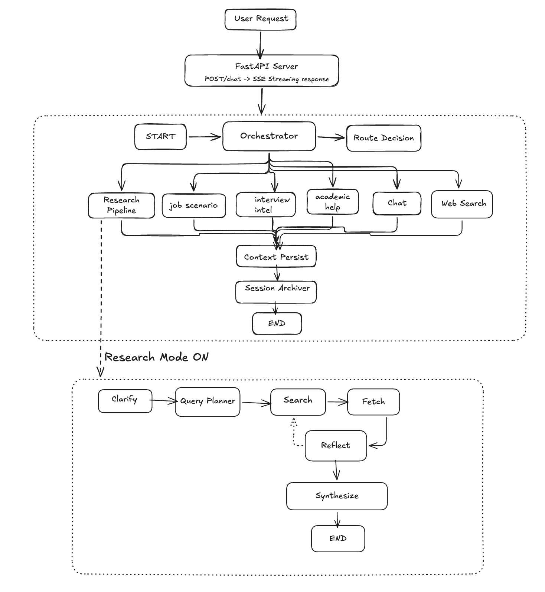

# ResearchOrchestra

**An AI-powered multi-agent research platform for students.** ResearchOrchestra uses a LangGraph supervisor-worker architecture to autonomously handle career research, interview preparation, job market analysis, and academic deep-dives — delivering structured, source-cited reports via a real-time streaming interface.

---

## 🌐 Production Deployment

ResearchOrchestra is deployed in a secure and multi-tier production environment designed for high-performance agent streaming and data persistence:

* **Frontend Hosting**: Next.js deployed globally on **Vercel** (`https://research-orchestra.vercel.app`) with native, automated SSL.
* **Backend Hosting & Interactive API Docs**: FastAPI containerized and managed via **Docker Compose** on an **AWS EC2** instance (`t3.micro`) running Ubuntu 24.04 LTS. Live interactive **Swagger API Documentation** is accessible at [research-orchestra-backend.duckdns.org/docs](https://research-orchestra-backend.duckdns.org/docs)!
* **Reverse Proxy & SSL**: **Nginx** acting as a high-performance reverse proxy, fully secured with a globally trusted SSL certificate from **Certbot (Let's Encrypt)** (`https://research-orchestra-backend.duckdns.org`).
* **Database Engine**: **AWS RDS (PostgreSQL 16)** handling persistent supervisor checkpointers and long-term memory.

---

## Table of Contents

- [Overview](#overview)
- [Production Deployment](#production-deployment)
- [Key Features](#key-features)
- [Architecture](#architecture)
- [Tech Stack](#tech-stack)
- [Project Structure](#project-structure)
- [Getting Started](#getting-started)
  - [Prerequisites](#prerequisites)
  - [Option A — Docker Compose (Recommended)](#option-a--docker-compose-recommended)
  - [Option B — Manual Setup](#option-b--manual-setup)
- [Environment Variables](#environment-variables)
- [API Reference](#api-reference)
- [Graph Visualization](#graph-visualization)

---

## Overview

ResearchOrchestra operates in two modes:

**Chat Mode** — an LLM-powered orchestrator classifies each message and delegates it to one of four specialist sub-agents (Web Search, Job Market, Interview Intel, Academic Help). Responses stream token-by-token in real time.

**Research Mode** — activates a six-node autonomous pipeline: `Clarify → Query Planner → Search → Fetch → Reflect → Synthesize`. The pipeline generates long-form, data-driven reports (500–1500+ lines) in Markdown, downloadable as PDF.

Both modes share persistent conversation history (PostgreSQL checkpointing) and cross-session long-term memory (LangGraph Store).

---

## Key Features

### Multi-Agent Orchestration
A central LangGraph supervisor graph classifies intent using structured LLM output and routes each request to the appropriate specialist — no brittle keyword matching, no hardcoded rules.

### Autonomous Research Pipeline
Three specialized research modes, each with tailored query plans, synthesis prompts, and output formats:

| Mode | Scope |
|---|---|
| **Interview Intelligence** | Interview questions, hiring process, culture, tech stack, salary, 3-day prep roadmap |
| **Job Scenario Analysis** | Hiring trends, skill demand, salary landscape, geographic hotspots, AI impact forecast |
| **Academic Deep-Dive** | Core concepts, recent research (2024–2026), case studies, exam FAQ, cheat sheet |

### Self-Reflective Coverage Check
After fetching pages, a `reflect` node critiques coverage using structured LLM output (`ReflectResult`) and dispatches up to 3 supplementary search queries before synthesis — capped at one reflection pass to bound latency.

### LangGraph Interrupt for Clarification
When a topic is too vague, the research pipeline calls `interrupt()` — the supervisor graph pauses and saves state to PostgreSQL. On the user's next message, the server calls `Command(resume=user_answer)` and execution continues from the exact checkpoint, avoiding a full restart.

### Long-Term Memory
- **Context Persist Node**: extracts atomic user facts (target role, location, companies researched) after every turn using structured LLM output and writes new facts to a PostgreSQL LangGraph Store.
- **Session Archiver Node**: summarises conversation windows every 10 messages and stores summaries, preventing context-window bloat on long sessions.

### Real-Time Streaming
Server-Sent Events (SSE) stream three event types from the FastAPI backend:
- `status` — agent status updates ("Searching 8 queries…")
- `token` — streamed LLM output appended directly into the chat bubble
- `interrupt` — clarification questions rendered as a structured UI prompt

### Report Export
Completed Research Mode reports include:
- **Download PDF** — generated client-side via `html2pdf.js` with clean typography, no Tailwind dependency
- **Copy Markdown** — full raw Markdown to clipboard

### Production-Ready Backend
- Rate limiting via `slowapi` (30 req/min on `/chat`)
- Firebase JWT verification on protected routes
- CORS configured via environment variable
- LangSmith tracing (optional, zero-code-change toggle)
- Docker Compose deployment with health checks and dependency ordering

---

## Architecture



---

## Tech Stack

| Layer | Technology |
|---|---|
| LLM | Groq — `llama-3.3-70b-versatile` |
| Agent Framework | LangGraph 0.x, LangChain Core |
| Web Search | Tavily Python SDK |
| Backend | FastAPI, Uvicorn, slowapi |
| Database | PostgreSQL 16 (LangGraph checkpointer + store) |
| Auth | Firebase (JWT verification, no service account needed) |
| Frontend | Next.js 16, React 19, TypeScript |
| Styling | Tailwind CSS v4, Framer Motion, Lucide React |
| Markdown | react-markdown |
| PDF Export | html2pdf.js |
| Observability | LangSmith (optional) |
| Deployment | Docker Compose |
| Package Manager | uv (Python), npm (Node) |

---

## Project Structure

```
ResearchOrchestra/
├── backend/
│   ├── agents/
│   │   ├── graph.py          # Orchestrator & Research Pipeline graph assembly + Sub-agent factory
│   │   ├── nodes.py          # All pipeline nodes
│   │   ├── prompts.py        # All LLM prompts (orchestrator, sub-agents)
│   │   ├── state.py          # SupervisorState & ResearchState schemas
│   │   └── tools.py          # Tavily web_search tool + node_search / node_fetch
│   ├── core/
│   │   ├── auth.py           # Firebase JWT verification
│   │   ├── client.py         # TavilySearchClient wrapper
│   │   ├── config.py         # Environment variable loading
│   │   ├── db.py             # PostgreSQL connection + LangGraph compilation
│   │   └── llm.py            # Groq LLM singleton
│   ├── tests/
│   │   ├── test_research_pipeline.py
│   │   └── test_server.py
│   ├── server.py             # FastAPI app, SSE streaming, all endpoints
│   ├── visualize_graphs.py   # Renders LangGraph PNGs
│   └── Dockerfile
├── frontend/
│   ├── src/
│   │   ├── app/
│   │   │   ├── auth/page.tsx     # Firebase sign-in / sign-up page
│   │   │   ├── chat/page.tsx     # Main dashboard (sidebar + streaming chat)
│   │   │   └── page.tsx          # Landing page
│   │   ├── context/
│   │   │   └── AuthContext.tsx   # Firebase auth state provider
│   │   └── lib/
│   │       └── firebase.ts       # Firebase SDK initialisation
│   ├── package.json
│   └── Dockerfile
├── docker-compose.yml
├── pyproject.toml
└── .env.example
```

---

## Getting Started

### Prerequisites

- Python 3.12+
- Node.js 18+
- Docker + Docker Compose (for Option A)
- PostgreSQL 16 (for Option B manual setup)
- API keys: [Groq](https://console.groq.com), [Tavily](https://tavily.com), [Firebase](https://console.firebase.google.com)

### Option A — Docker Compose (Recommended)

The compose file starts PostgreSQL, the FastAPI backend, and the Next.js frontend with proper dependency ordering and health checks.

**1. Clone and configure environment:**

```bash
git clone https://github.com/kannanpathania11/ResearchOrchestra.git
cd ResearchOrchestra
cp .env.example .env
```

Edit `.env` and fill in your API keys (see [Environment Variables](#environment-variables)).

Also configure `frontend/.env.local`:

```bash
NEXT_PUBLIC_FIREBASE_API_KEY=your_key
NEXT_PUBLIC_FIREBASE_AUTH_DOMAIN=your_project.firebaseapp.com
NEXT_PUBLIC_FIREBASE_PROJECT_ID=your_project_id
NEXT_PUBLIC_API_URL=http://localhost:8000
```

**2. Start all services:**

```bash
docker compose up --build
```

- Frontend: `http://localhost:3000`
- Backend API: `http://localhost:8000`
- Health check: `http://localhost:8000/health`

---

### Option B — Manual Setup

**Backend:**

```bash
# Install uv (if not already installed)
pip install uv

# Install dependencies
uv sync

# Activate virtual environment
source .venv/bin/activate   # macOS/Linux
# or
.venv\Scripts\activate      # Windows

# Set environment variables
cp .env.example .env
# Edit .env with your keys

# Start the server
uvicorn backend.server:app --reload --host 0.0.0.0 --port 8000
```

**Frontend:**

```bash
cd frontend
npm install
cp .env.local.example .env.local   # or create manually
npm run dev
```

The dev server starts at `http://localhost:3000`.

---

## Environment Variables

| Variable | Required | Description |
|---|---|---|
| `GROQ_API_KEY` | Yes | Groq API key — powers the LLM (Llama 3.3 70B) |
| `TAVILY_API_KEY` | Yes | Tavily API key — powers all web search |
| `DATABASE_URL` | Yes | PostgreSQL connection string |
| `FIREBASE_PROJECT_ID` | Yes | Firebase project ID for JWT verification |
| `ALLOWED_ORIGINS` | Yes | Comma-separated CORS origins (e.g. `http://localhost:3000`) |
| `LANGCHAIN_TRACING_V2` | No | Set `true` to enable LangSmith tracing |
| `LANGCHAIN_API_KEY` | No | LangSmith API key (required if tracing enabled) |
| `LANGCHAIN_PROJECT` | No | LangSmith project name (default: `ResearchOrchestra`) |

Frontend (`frontend/.env.local`):

| Variable | Description |
|---|---|
| `NEXT_PUBLIC_FIREBASE_API_KEY` | Firebase web API key |
| `NEXT_PUBLIC_FIREBASE_AUTH_DOMAIN` | Firebase auth domain |
| `NEXT_PUBLIC_FIREBASE_PROJECT_ID` | Firebase project ID |
| `NEXT_PUBLIC_API_URL` | Backend URL (default: `http://localhost:8000`) |

---

## API Reference

| Method | Endpoint | Description |
|---|---|---|
| `POST` | `/chat` | Start or continue a conversation (SSE Stream) |
| `GET` | `/chat/history` | List all conversation threads for a user |
| `GET` | `/chat/history/{thread_id}` | Return full message history for a specific thread |
| `DELETE` | `/chat/history/{thread_id}` | Permanently delete a conversation thread and all checkpoints |
| `GET` | `/health` | Health check endpoint |

---

## Running Tests

```bash
# From the project root with the virtual environment active
pytest backend/tests/ -v
```

---


## Contact
- 💼 [LinkedIn](https://www.linkedin.com/in/kannanpathania)
- ✉️ [Email](mailto:kannanpathania@gmail.com)

