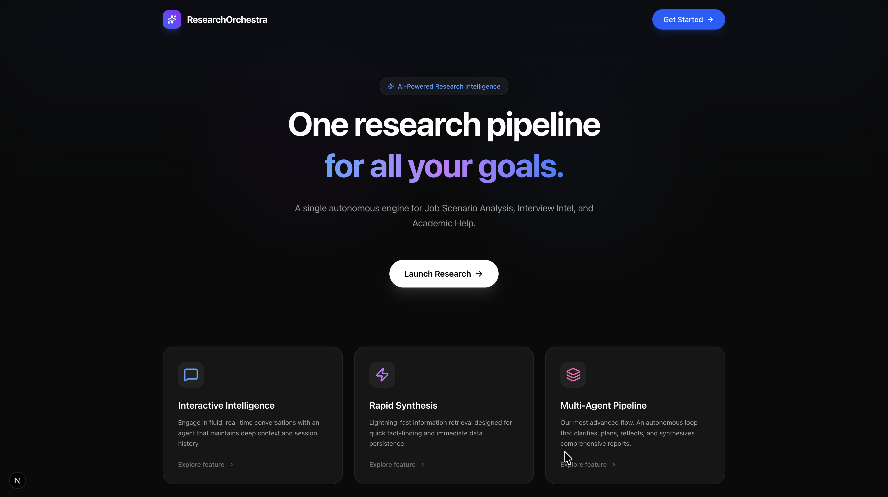
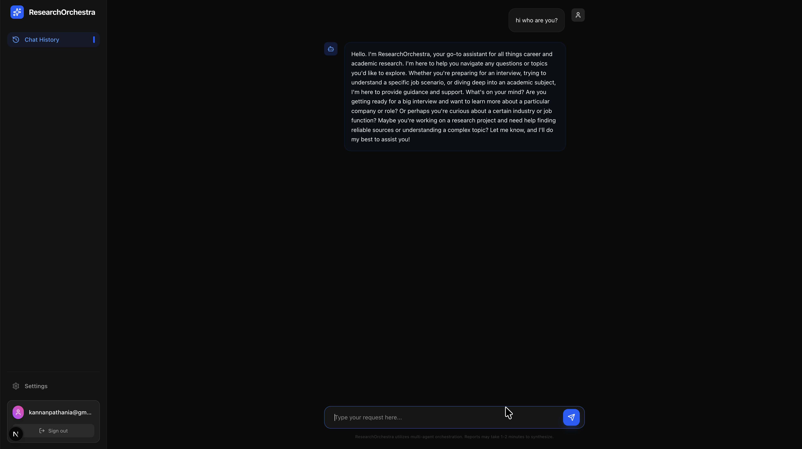
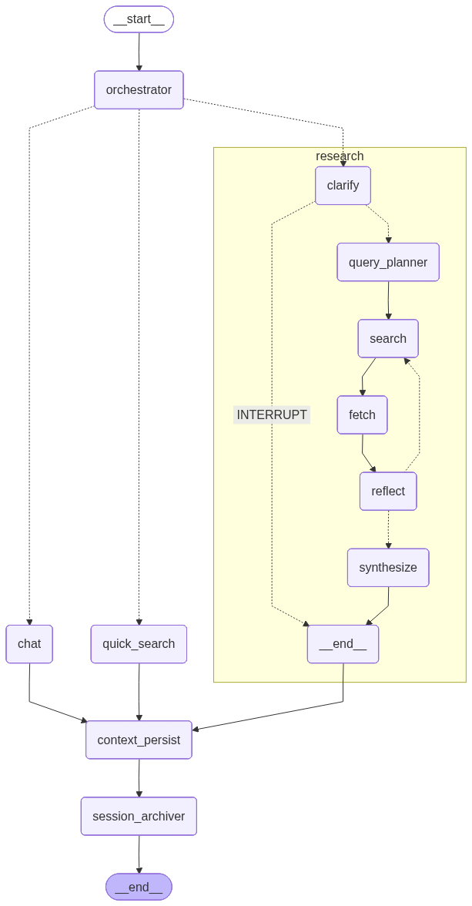

# 🕵️‍♂️ ResearchOrchestra: Your Personal Intelligence Agency

**ResearchOrchestra** is a sophisticated multi-agent research platform designed to synthesize high-fidelity intelligence. Built with **LangGraph** and **FastAPI**, it uses a supervisor-worker architecture to handle complex career and academic research tasks autonomously.

---

## 🚀 Core Features

### 1. Unified Research Pipeline
A single, powerful autonomous engine that dynamically adapts to three specialized modes:
- **💼 Job Scenario Analysis**: Deep-dives into job market dynamics, salary benchmarks, and skill demand.
- **🎯 Interview Intel**: Uncovers company culture and hiring processes to generate targeted preparation reports.
- **📚 Academic Help**: Transforms complex topics into comprehensive study guides and research deep-dives.

### 2. Autonomous Reflection Loop
Unlike standard search agents, ResearchOrchestra doesn't just find data—it **self-reflects**. The system critiques its own findings to ensure accuracy, depth, and relevance before synthesizing the final report.

### 3. Persistent Contextual Memory
Powered by **PostgreSQL**, the system maintains long-term memory of user goals, previous research, and session context, allowing for fluid multi-turn intelligence gathering.

---

## 🏗️ Technical Architecture

The project follows a **Supervisor-Worker** pattern using LangGraph:

- **Orchestrator (Supervisor)**: Analyzes user intent and routes queries to the appropriate pathway (Chat, Quick Search, or Research).
- **Specialized Sub-Agents**: When in Research mode, the system triggers a multi-stage pipeline:
  - `Clarify` ➔ `Plan` ➔ `Search` ➔ `Fetch` ➔ `Reflect` ➔ `Synthesize`.
- **Backend**: FastAPI with asynchronous streaming for real-time status updates and token-by-token report generation.
- **Frontend**: A premium, dark-mode Next.js dashboard featuring Framer Motion animations and a dynamic UI.

---

## 📸 User Interface

### Main Landing Page
 
*(The landing page features a simplified hero section and a use-case carousel highlighting the core research modes.)*

### Chat Interface
 
*The chat interface features a premium, dark-mode UI.*

### Research Pipeline Visualization

---

## 🛠️ Tech Stack

- **Frameworks**: LangChain, LangGraph, FastAPI, Next.js 14 (App Router)
- **AI Models**: Groq (Llama-3), Tavily (Search)
- **Database**: PostgreSQL (pgvector ready)
- **Styling**: Tailwind CSS, Framer Motion, Lucide Icons

---

## 🏃‍♂️ Getting Started

### Backend Setup
1. Navigate to `backend/`
2. Install dependencies: `pip install -r requirements.txt` (or use `uv`)
3. Set up your `.env` with `GROQ_API_KEY`, `TAVILY_API_KEY`, and `DATABASE_URL`.
4. Run the server: `python server.py`

### Frontend Setup
1. Navigate to `frontend/`
2. Install dependencies: `npm install`
3. Run the development server: `npm run dev`

---

## 📜 License
This project is for portfolio demonstration purposes.

